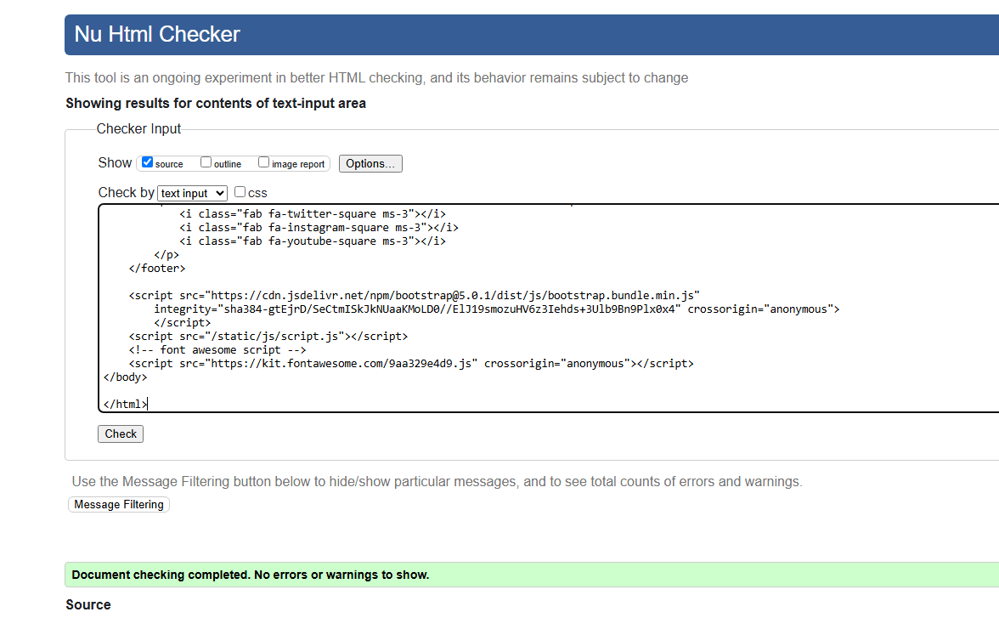

# The Arcadean - Snake Game

# About This Project
This is a classic Snake game built for the web! It's the kind of game you might remember from old Nokia phones or arcade machines. The player controls a snake that moves around the screen, eating food to grow bigger while trying not to crash into walls or itself.

We built this as an enhanced version of our previous project called "The Arcadean" - a collection of retro arcade games. For this hackathon, we took the original frontend-only Snake game and added a full Django backend to create a more complete web application. The goal was to create something fun and nostalgic that works on any device while demonstrating our ability to integrate frontend games with backend database functionality.

**[Play the Game Here!](https://ci-django-hackathon-30d66066d9ca.herokuapp.com/)**

## Table of Contents
- [Project Outline](#project-outline)
    - [Key Objectives](#key-objectives)
- [UX Design](#ux-design)
    - [Design Ideas](#design-ideas)
    - [User Stories](#user-stories)
    - [Colour Palette](#colour-palette)
    - [Wireframes](#wireframes)
    - [Fonts](#fonts)
- [Features](#features)
- [Deployment / Dependencies](#deployment--dependencies)
- [Accounts](#accounts)
- [AI Implementation](#ai-implementation)
- [Testing and Validation](#testing-and-validation)
    - [HTML Validation](#html-validation)
    - [CSS Validation](#css-validation)
    - [JavaScript Validation](#javascript-validation)
    - [Accessibility Testing](#accessibility-testing)
- [Technology](#technology)
- [References](#references)
- [External Resource Links](#external-resource-links)
- [Credits](#credits)

---

## Project Outline
This project builds upon our previous "Arcadean" arcade game collection by adding a comprehensive Django backend to the Snake game. We transformed what was originally a simple frontend-only game into a full-stack web application with user authentication, score tracking, and database persistence.

The original Arcadean project was a static collection of browser-based arcade games. For this hackathon, we chose to enhance the Snake game specifically by implementing:

- **User Authentication System:** Players can create accounts, log in, and maintain their gaming profiles
- **Score Persistence:** High scores are saved to a database and persist between sessions
- **User Profiles:** Players can view their gaming statistics and progress over time
- **Administrative Features:** Backend admin interface for managing users and game data

### Key Objectives

- **Enhance Previous Work:** Build upon our existing Arcadean project by adding backend functionality
- **Implement Full CRUD Operations:** Create, Read, Update, and Delete functionality for user data and scores
- **Add User Authentication:** Secure login/logout system with user registration
- **Persist Game Data:** Save high scores and user progress to a database
- **Maintain Game Quality:** Keep the fun, nostalgic gameplay while adding new features
- **Create Admin Interface:** Build administrative tools for managing the application
- **Ensure Security:** Implement proper user authentication and data protection

## UX Design

We focused on keeping things simple and clear. The design is inspired by old arcade games with pixelated graphics and bright colors that are easy to see.

### Design Ideas
- **Keep it Simple:** No complicated menus or confusing buttons - just the game and your score
- **Retro Look:** Pixel-style graphics that look like classic video games
- **Works on All Screens:** The game adjusts to fit phones, tablets, and computer screens
- **Easy to Read:** Score and instructions are big and clear
- **Consistent Style:** Everything looks like it belongs together

### User Stories

- **As a player**, I want to use arrow keys to move my snake around the screen
- **As a player**, I want to see my score go up when I eat food
- **As a player**, I want my snake to get longer when it eats food so I can see my progress
- **As a player**, I want the game to end when I crash, so I know when I've lost
- **As a player**, I want to easily start a new game after I lose
- **As someone on a phone**, I want touch controls that work well on my small screen
- **As any user**, I want the game to load quickly so I don't have to wait
- **As any user**, I want to see clear feedback when something happens in the game

### Colour Palette

We chose bright, fun colors that remind people of classic arcade games while making sure everything is easy to see and read.

### Fonts
- **Main Font:** Jersey 10 (Google Fonts) - This looks like old video game text
- **Backup Font:** Arial - In case the main font doesn't load

### Wireframes

We sketched out how the game should look before we started coding. This helped us plan where to put the game area, score, and controls.

### Final result

These show how the game looks on different screens including user registration, sign in, and actual gameplay.

## Features

### Game Features
- **Classic Snake Gameplay:** Control a snake that moves around and eats food to grow
- **Real-time Scoring:** Watch your points go up as you eat food
- **Game Over Detection:** The game ends when you hit a wall or your own tail
- **Responsive Controls:** Use arrow keys on computer or swipe on phone
- **Instant Restart:** Quickly start a new game when you're done

### Backend Features (New!)
- **User Registration:** Create your own account to track your progress
- **Secure Login/Logout:** Safe authentication system to protect your data
- **Score Persistence:** Your high scores are automatically saved to the database
- **Personal Profile:** View your gaming statistics and score history
- **Leaderboards:** See how you rank against other players
- **Admin Dashboard:** Administrative interface for managing users and scores

### CRUD Operations
Our Django backend implements full CRUD (Create, Read, Update, Delete) functionality:

#### Create
- **User Registration:** New players can create accounts
- **Score Recording:** Game scores are automatically created and saved

#### Read
- **Leaderboards:** Display top scores from all players

#### Update
- **Score Updates:** High scores are automatically updated when beaten

#### Delete
- **Score Management:** Users can remove their scores if they will
- **Admin Management:** Administrators can remove inappropriate scores

### Technical Features
- **Database Integration:** SQLite database for development, scalable to PostgreSQL for production
- **Responsive Design:** Works seamlessly on phones, tablets, and computers
- **Security Features:** Password hashing, session management, and CSRF protection

## Deployment / Dependencies

### Online Version
Just click the link at the top of this README to play in your browser!

### Run It Yourself
If you want to run this on your own computer:

1. Download or clone this project
2. Make sure you have Python installed
3. Install Django: `pip install django`
4. Run: `python manage.py runserver`
5. Open your browser and go to the address it shows you

### What You Need
- A web browser (Chrome, Firefox, Safari, etc.)
- For running locally: Python and Django

## Accounts
- A GitHub account is required to deploy and manage the project repository.
- Optional: Font Awesome account for custom icon kits.

## AI Implementation

We used GitHub Copilot to help us with this project. Here's how it helped:

- **Code Suggestions:** When we got stuck, it suggested code that might work
- **Bug Fixing:** It helped us find and fix problems in our code
- **Best Practices:** It reminded us of good ways to write code
- **Documentation:** It helped us write parts of this README

This was really helpful for learning new techniques and solving problems faster!

## Testing and Validation

We tested our code to make sure it works properly and follows web standards.

### HTML Validation
We used the [W3C HTML Validator](https://validator.w3.org/) to check that our HTML code is written correctly.

### CSS Validation
We used the [W3C CSS Validator](https://jigsaw.w3.org/css-validator/) to make sure our CSS follows the rules.

### JavaScript Validation
We used [JSHint](https://jshint.com/) to check our JavaScript for errors and bad practices.

We fixed any problems it found to make our code better.

### Accessibility Testing
We used the WAVE tool to check if people with disabilities can use our game.

We fixed contrast issues to make the text easier to read.

## Technology

### Frontend Technologies (From Original Arcadean)
- **HTML5 Canvas:** Used for rendering the game graphics and smooth animations
- **CSS3:** Implements responsive design and retro arcade styling
- **Vanilla JavaScript:** Handles all game logic, movement, and scoring
- **Google Fonts:** Jersey 10 font for authentic arcade aesthetics

### Backend Technologies (New Django Implementation)
- **Python 3.12+:** Core programming language for backend development
- **Django 4.2+:** Web framework providing:
  - Model-View-Template (MVT) architecture
  - User authentication and session management
  - Database integration with ORM
  - Admin interface for content management
  - Security features (CSRF protection, password hashing)
- **SQLite:** Development database (easily scalable to PostgreSQL for production)
- **Django ORM:** Object-relational mapping for database operations

### Database Models
Our Django backend includes the following models:

#### User Profile Model
- Extends Django's built-in User model
- Stores additional gaming statistics
- Tracks user preferences and settings

#### Game Scores Model
- Records individual game scores
- Links scores to specific users
- Timestamps for score tracking
- Validation for score authenticity

### CRUD Implementation Details
- **Models:** Django models define our data structure (User profiles, Game scores)
- **Views:** Django views handle CRUD operations and game logic
- **Templates:** HTML templates render user interfaces and game displays
- **Forms:** Django forms manage user input and data validation
- **URLs:** URL routing connects frontend requests to backend functionality

### Tools We Used
- **VS Code:** Where we wrote our code
- **Git & GitHub:** To save different versions of our code and share it
- **GitHub Copilot:** AI assistant that helped us write code
- **Django Admin:** Built-in admin interface for managing data
- **Chrome DevTools:** To test and debug our code
- **SQLite Browser:** For examining database contents during development

## References

### Learning Resources
- [MDN Web Docs](https://developer.mozilla.org/) - Great for learning HTML, CSS, and JavaScript
- [W3Schools](https://www.w3schools.com/) - Simple tutorials and examples
- [Django Documentation](https://docs.djangoproject.com/) - Official Django guides

## External Resource Links
- [Balsamiq](https://balsamiq.com/) - For creating wireframes
- [Google Fonts](https://fonts.google.com/) - For typography
- [Squoosh](https://squoosh.app/) - For making images smaller
- [Flaticon](https://www.flaticon.com/) - For game icons

## Credits
- **Game Inspiration:** Classic Snake games from Nokia phones and arcade machines
- **Code Help:** GitHub Copilot for suggestions and debugging
- **Design Ideas:** Retro arcade aesthetic and pixel art styles
- **Testing:** Online validators and accessibility tools

- **Documentation:** Django documentation and Stack Overflow